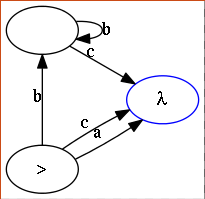

automaton
=========

Generator of state machines that accept the same language of a given regular expression.

## Draw the state machine associated to a regular expressions tree ##

```python
import pygraphviz as g

from automaton import nodes as r
from automaton.state_machine import to_state_machine

regex = r.Choice(
    r.Constant('a'),
    r.Concat(
        r.Repeat(r.Constant('b')),
        r.Constant('c')
    )
)

graph = g.AGraph(directed=True, strict=False)
for node, edge in st:
    target_node = st[node, edge]
    if type(target_node) is r.Null:
        continue
    graph.add_node(node)
    graph.add_edge(node, target_node, label=edge)
graph.layout()
graph.draw('output.png')
```

Then, `output.png` will be:


